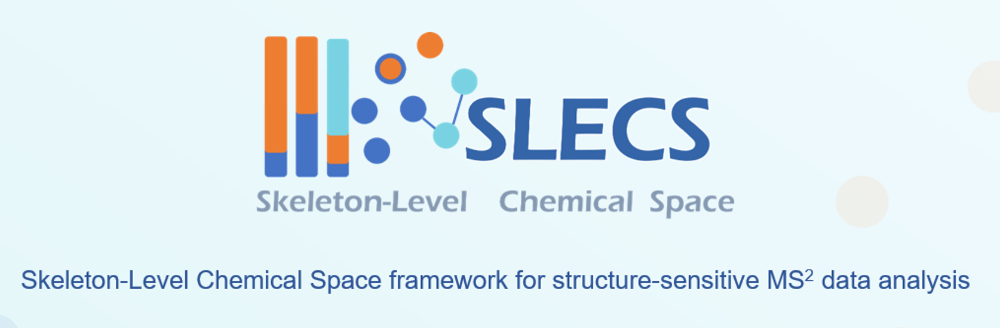

# MS2NMF-demo





MS2NMF (Submission Version)
===================

Description
-----------
This repository provides a submission-stage version of SLECS (Skeleton-Level Chemical Space), including a minimal reproducible demo of the NMF decomposition step, a pre-generated fragment-intensity matrix for direct testing, and a static web-based interface for conceptual illustration of the framework. The complete preprocessing workflow and full datasets are described in the manuscript and will be released upon publication.


## Directory Structure

```plaintext
MS2NMF/
├── README.md       
├── requirements.txt
├── docs/         
└── demo/            
``` 

## DATA
 The `demo/` folder provides a pre-generated optimized fragment-intensity matrix (`demo_optimized_fragment_matrix.csv`) as direct input for NMF decomposition within the SLECS framework. The complete preprocessing workflow is described in the manuscript, and all related code and datasets will be released upon publication.


## Contact

For questions regarding the dataset or workflow,please contact shuchenlan@simm.ac.cn(Chenlan Shu) or yuzhuohao@simm.ac.cn(Zhuohao Yu)
